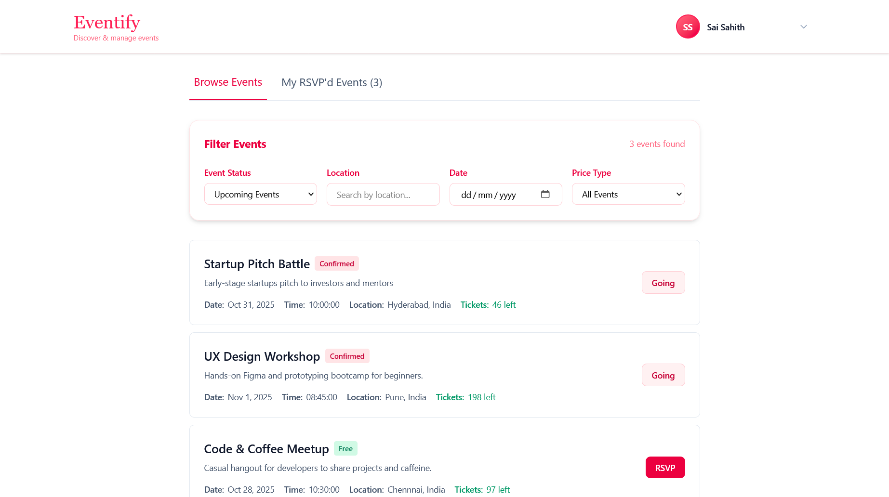

# Eventify - Full-Stack Event Management Platform

Eventify is a complete event management application that allows users to discover, RSVP for, and manage events. Organizers can create, manage, and track their events, including ticket sales and attendee statistics.

## Features

**User Authentication**: Secure user registration and login using JWT.

**Role-Based Access Control**: Distinct dashboards and permissions for "Attendees" and "Organizers".

**Event Management (for Organizers)**:
- Create, edit, and delete events.
- Add free / paid tickets for events.
- Admin dashboard to view event statistics, total revenue, and attendee lists.
- Export attendee details in PDF and CSV formats.

**Event Discovery (for Attendees)**:
- Browse and filter upcoming events.
- View detailed event information.
- RSVP to events.
- Cancel RSVPs
- Add the event to Google Calendar

**Automated Email Notifications**:
- Sends confirmation emails upon successful RSVP.
- Sends reminder emails 2 hours before an event starts.

**Containerized Deployment**: Fully dockerized frontend, backend, and database services for easy setup and deployment.

## Tech Stack

- **Frontend**: React, Vite, Tailwind CSS, React Router
- **Backend**: Node.js, Express.js
- **Database**: PostgreSQL
- **Authentication**: JWT (JSON Web Tokens), bcrypt
- **Containerization**: Docker, Docker Compose
- **Web Server**: NGINX (for serving the frontend)

## Getting Started

### Prerequisites

- Node.js (v20.x or later)
- Docker and Docker Compose
- PostgreSQL (v12 or later)

### 1. Local Environment Setup

Follow these steps to run the application on your local machine without Docker.

#### A. Clone the repository:
```bash
git clone <your-repository-url>
cd Eventify
```

#### B. Set up the Backend:
```bash
cd server
npm install
```

Create a `.env` file in the `server` directory and add the following variables:
```env
# server/.env
JWT_SECRET_KEY="your_super_secret_jwt_key"
CLIENT_URL="http://localhost"
TEST_DATABASE_URL="postgresql://<user>:<password>@localhost:5432/eventify_test_db"
DATABASE_URL="postgresql://<user>:<password>@localhost:5432/eventify_db"
NODE_ENV="development"

# Email Service (Gmail Example)
EMAIL_SERVICE="gmail"
EMAIL_USER="your-email@gmail.com"
EMAIL_PASSWORD="your-gmail-app-password"
```

#### C. Set up the Frontend:
```bash
cd client
npm install
```

Create a `.env` file in the `client` directory:
```env
# client/.env
VITE_API_URL="http://localhost:3000/api"
```

#### D. Run the Application:

Start the backend server (from the `server` directory):
```bash
npm start
```

Start the frontend development server (from the `client` directory):
```bash
npm run dev
```

The application will be available at `http://localhost:5173`.

### 2. Database Setup

#### A. Install PostgreSQL:

If you haven't already, install PostgreSQL on your local machine:

- **macOS**: `brew install postgresql`
- **Ubuntu/Debian**: `sudo apt-get install postgresql postgresql-contrib`
- **Windows**: Download from [postgresql.org](https://www.postgresql.org/download/)

#### B. Create the Database:

Start PostgreSQL service and create the required databases:
```bash
# Start PostgreSQL (if not already running)
# macOS: brew services start postgresql
# Linux: sudo service postgresql start

# Create the main database
createdb eventify_db

# Create the test database (for running tests)
createdb eventify_test_db
```

Or using PostgreSQL command line:
```sql
psql postgres
CREATE DATABASE eventify_db;
CREATE DATABASE eventify_test_db;
\q
```

#### C. Set up Database Schema:

The application uses the following database schema. You can create the tables manually or use a migration tool.

**Create Tables**:
```sql
-- Connect to your database
psql eventify_db

CREATE TABLE users (
    id SERIAL PRIMARY KEY,
    name VARCHAR NOT NULL,
    email VARCHAR NOT NULL UNIQUE,
    password_hash TEXT NOT NULL,
    role TEXT NOT NULL
);

CREATE TABLE events (
    id SERIAL PRIMARY KEY,
    title VARCHAR NOT NULL,
    description TEXT,
    date TIMESTAMP NOT NULL,
    location VARCHAR,
    organizer_id INTEGER NOT NULL,
    time TIME NOT NULL,
    CONSTRAINT events_organizer_id_fkey FOREIGN KEY (organizer_id) 
        REFERENCES users(id) ON DELETE CASCADE
);

CREATE TABLE tickets (
    id SERIAL PRIMARY KEY,
    event_id INTEGER NOT NULL,
    type VARCHAR NOT NULL CHECK (type IN ('free', 'paid')),
    price NUMERIC DEFAULT 0.00,
    quantity INTEGER NOT NULL DEFAULT 1 CHECK (quantity > 0),
    CONSTRAINT tickets_event_id_fkey FOREIGN KEY (event_id) 
        REFERENCES events(id) ON DELETE CASCADE
);

CREATE TABLE rsvps (
    id SERIAL PRIMARY KEY,
    event_id INTEGER NOT NULL,
    user_id INTEGER NOT NULL,
    ticket_id INTEGER,
    status VARCHAR NOT NULL CHECK (status IN ('confirmed', 'cancelled')),
    CONSTRAINT rsvps_event_id_fkey FOREIGN KEY (event_id) 
        REFERENCES events(id) ON DELETE CASCADE,
    CONSTRAINT rsvps_user_id_fkey FOREIGN KEY (user_id) 
        REFERENCES users(id) ON DELETE CASCADE,
    CONSTRAINT rsvps_ticket_id_fkey FOREIGN KEY (ticket_id) 
        REFERENCES tickets(id) ON DELETE SET NULL
);

CREATE INDEX idx_events_organizer ON events(organizer_id);
CREATE INDEX idx_events_date ON events(date);
CREATE INDEX idx_rsvps_event ON rsvps(event_id);
CREATE INDEX idx_rsvps_user ON rsvps(user_id);
CREATE INDEX idx_tickets_event ON tickets(event_id);
```

#### D. Verify Database Connection:

Update your `.env` file with the correct database credentials:
```env
DATABASE_URL="postgresql://<username>:<password>@localhost:5432/eventify_db"
TEST_DATABASE_URL="postgresql://<username>:<password>@localhost:5432/eventify_test_db"
```

Replace `<username>` and `<password>` with your PostgreSQL credentials. The default username is often `postgres`.

#### E. Test the Connection:

You can test the database connection by running:
```bash
cd server
npm start
```

If the connection is successful, you should see a message indicating the server is running.

### 3. Docker Environment Setup

This is the recommended method for a quick and consistent setup.

#### A. Clone the repository:
```bash
git clone <your-repository-url>
cd Eventify
```

#### B. Create Environment File:

Create a `.env` file in the root of the project and add your secrets. The `docker-compose.yml` file is configured to use these variables.
```env
# .env (at the project root)
# Backend Secrets
JWT_SECRET_KEY="your_super_secret_jwt_key"
CLIENT_URL="http://localhost"
TEST_DATABASE_URL="postgresql://postgres:postgres@db:5432/eventify_test_db"
DATABASE_URL="postgresql://postgres:postgres@db:5432/eventify_db"
NODE_ENV="production"

# Email Service
EMAIL_SERVICE="gmail"
EMAIL_USER="your-email@gmail.com"
EMAIL_PASSWORD="your-gmail-app-password"
```

#### C. Build and Run with Docker Compose:

From the root of the project, run:
```bash
docker-compose up --build -d
```

The application will be available at:
- **Frontend**: `http://localhost`
- **Backend API**: `http://localhost/api` (proxied through NGINX)

To stop the services, run: `docker-compose down`.

---

## API Documentation

The API is structured to be RESTful. You can use tools like Postman or Insomnia to interact with the endpoints.

### Authentication

| Method | Endpoint           | Description                   |
| :----- | :----------------- | :---------------------------- |
| POST   | /api/auth/signup   | Register a new user.          |
| POST   | /api/auth/login    | Log in and receive a JWT.     |
| POST   | /api/auth/logout   | Log out and clear the cookie. |

### Events

| Method | Endpoint                | Description                          | Auth Required |
| :----- | :---------------------- | :----------------------------------- | :------------ |
| GET    | /api/events             | Get all events.                      | Yes           |
| POST   | /api/events             | Create a new event.                  | Organizer     |
| GET    | /api/events/my-events   | Get events created by the organizer. | Organizer     |
| GET    | /api/events/:id         | Get a single event by ID.            | Yes           |
| PUT    | /api/events/:id         | Update an event.                     | Organizer     |
| DELETE | /api/events/:id         | Delete an event.                     | Organizer     |
| GET    | /api/events/:id/stats   | Get statistics for an event.         | Organizer     |
| GET    | /api/users/:id/         | Get user details.                    | Yes           |

### Tickets

| Method | Endpoint                             | Description              | Auth Required |
| :----- | :----------------------------------- | :----------------------- | :------------ |
| GET    | /api/events/:id/tickets              | Get tickets on an event. | Yes           |
| POST   | /api/events/:id/tickets              | Add tickets to an event. | Organizer     |
| PUT    | /api/events/:id/tickets/:ticket_id   | Update a ticket.         | Organizer     |
| DELETE | /api/events/:id/tickets/:ticket_id   | Delete a ticket.         | Organizer     |

### RSVPs

| Method | Endpoint              | Description                         | Auth Required |
| :----- | :-------------------- | :---------------------------------- | :------------ |
| GET    | /api/events/:id/rsvps | Get all RSVPs for a specific event. | Organizer     |
| GET    | /api/rsvps/my         | Get all RSVPs for the current user. | Yes           |
| POST   | /api/rsvps            | RSVP for an event.                  | Yes           |
| DELETE | /api/rsvps/:id        | Cancel an RSVP.                     | Yes           |

---

## Testing

### Test Setup

#### Backend Test Configuration

1. **Create Test Database**:
```bash
createdb eventify_test_db
```

2. **Configure Test Environment**:

Add to your `server/.env` file:
```env
# Test Database
NODE_ENV=test
TEST_DATABASE_URL="postgresql://<user>:<password>@localhost:5432/eventify_test_db"
```

3. **Run Backend Tests**:
```bash
cd server
npm test                    # Run all tests
npm test -- auth.test.js    # Run specific test file
```

#### Frontend Test Configuration

1. **Install Dependencies**:
```bash
cd client
npm install
```

2. **Run Frontend Tests**:
```bash
npm test                        # Run all tests in watch mode
npm test -- --run               # Run tests once
npm test -- Dashboard.test.jsx  # Run specific test file
```

---

### Dashboard - Browse Events

*Browse and filter events with search functionality*

### Event Details

*View comprehensive event information and RSVP*

### My RSVP'd Events

*View all events you've registered for*

### Create Event (Organizer)

*Create new events with detailed information*

### My Events (Organizer)

*Manage all your created events with statistics*

### Admin Dashboard (Organizer)

*Track RSVPs, revenue, and attendee analytics*

### Export Attendees (Organizer)

*Export attendee lists in CSV or PDF format*

---

## Database Schema
```sql
CREATE TABLE users (
    id SERIAL PRIMARY KEY,
    name VARCHAR NOT NULL,
    email VARCHAR NOT NULL UNIQUE,
    password_hash TEXT NOT NULL,
    role TEXT NOT NULL
);

CREATE TABLE events (
    id SERIAL PRIMARY KEY,
    title VARCHAR NOT NULL,
    description TEXT,
    date TIMESTAMP NOT NULL,
    location VARCHAR,
    organizer_id INTEGER NOT NULL,
    time TIME NOT NULL,
    CONSTRAINT events_organizer_id_fkey FOREIGN KEY (organizer_id) 
        REFERENCES users(id)
);

CREATE TABLE tickets (
    id SERIAL PRIMARY KEY,
    event_id INTEGER NOT NULL,
    type VARCHAR NOT NULL CHECK (type IN ('free', 'paid')),
    price NUMERIC DEFAULT 0.00,
    quantity INTEGER NOT NULL DEFAULT 1 CHECK (quantity > 0),
    CONSTRAINT tickets_event_id_fkey FOREIGN KEY (event_id) 
        REFERENCES events(id)
);

CREATE TABLE rsvps (
    id SERIAL PRIMARY KEY,
    event_id INTEGER NOT NULL,
    user_id INTEGER NOT NULL,
    ticket_id INTEGER,
    status VARCHAR NOT NULL CHECK (status IN ('confirmed', 'cancelled')),
    CONSTRAINT rsvps_event_id_fkey FOREIGN KEY (event_id) 
        REFERENCES events(id),
    CONSTRAINT rsvps_user_id_fkey FOREIGN KEY (user_id) 
        REFERENCES users(id),
    CONSTRAINT rsvps_ticket_id_fkey FOREIGN KEY (ticket_id) 
        REFERENCES tickets(id)
);
```

---
